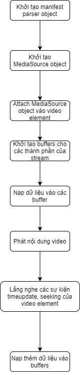

# Báo cáo tuần 1

## 1. Media file basics
- Serving video files
    - Quá trình truyền tải video files cần trải qua nhiều bước xử lý và lưu trữ video, bao gồm sinh ra các file manifests mô tả thông tin cần thiết của video, các độ phân giải khác nhau của video và thêm nhiều yêu cầu phức tạp khác.
    - Video files có thể mang nhiều định dạng khác nhau, một số định dạng phổ biến có thể kể đến như ```.mov``` hoặc ```.mp4```. Tuy nhiên, kích thước của các files ở các định dạng này thường khá lớn, điều này khiến cho việc phát các video trên các thiết bị di động trở nên khó khăn. Hơn nữa, các trình duyệt web cũng hỗ trợ các kiểu định dạng khác nhau, vì thế chúng ta cần tạo các files ở định dạng khác tối ưu hơn và có thể là sinh thêm các files manifest để hỗ trợ adaptive streaming.
- Các khái niệm
    - Containers, codecs, streams
        - Container là file chứa một hoặc nhiều luồng (stream). Một file media có thể có số lượng tùy ý các luồng thuộc nhiều định dạng khác nhau.
        - Bên trong các luồng audio hoặc video, dữ liệu thật sự được nén dùng *codec*. Codec là kiểu định dạng nén cho dữ liệu video hoặc audio. Codec khác container ở chỗ các files với cùng 1 kiểu container có thể có nội dung được nén với nhiều kiểu codecs khác nhau
        - Codec formats: Một số định dạng phổ biến

            | **File type** | **Video codec**| **Audio codec** |
            | ------------| ---------|------|
            |MP4|AV1, AVC (H.264), VP9|AAC|
            |WebM|AV1, VP9|Vorbis, Opus|
    - Bitrate: Số bits tối đa cần dùng để nén 1 giây của một luồng media. Bitrate càng cao thì chất lượng hình ảnh càng tốt, tuy nhiên băng thông chiếm dụng cũng càng nhiều 
    - Resolution: 
        - Số lượng điểm ảnh trong 1 video frame, tính theo mỗi chiều 
        - Khi chuẩn bị video files cho DASH hoặc HLS, chúng ta có thể chọn một hoặc nhiều độ phân giải khác nhau


## 2. Media streaming basics
- Media streaming là cách thức truyền tải và phát nội dung media theo từng thành phần nhỏ hơn của 1 file gốc.
- Thay vì load nội dung của toàn bộ file, ứng dụng phát đọc một file manifest mô tả cách thức file media được chia thành các đoạn (chunk) dữ liệu nhỏ hơn.
- Các đoạn media sẽ được load dần đến khi thu được toàn bộ nội dung của file media gốc.
- Giao thức streaming: 
    - 2 giao thức phổ biến nhất: DASH, HLS
    - Trình phát media hỗ trợ các giao thức này sẽ fetch nội dung file manifest mô tả, xác định các đoạn media nào cần request sau đó gộp lại để đem lại trải nghiệm cuối cùng cho người dùng

## 3. Adaptive streaming (DASH)
- Adaptive streaming là một kỹ thuật ở đó các video chunks được mã hóa với nhiều bitrates khác nhau để đem lại trải nghiệm tốt nhất cho người dùng dưới mọi điều kiện kết nối mạng.
- Một lợi ích chính mà adaptive streaming mang lại là khả năng thích nghi với sự thay đổi của tình trạng kết nối mạng. Các file manifests mô tả stream thường cung cấp thông tin về nhiều dạng biểu diễn khác nhau của cùng một tài nguyên video. Khi các biểu diễn đó khác nhau về bitrate, trình phát có thể đổi giữa các biểu diễn một cách tùy ý và luôn luôn lựa chọn chunk phù hợp với băng thông hiện tại.
- Trong adaptive streaming, media server được sử dụng để xử lý từ 1 video gốc và tạo thành nhiều phiên bản với độ phân giải, bitrate khác nhau, phù hợp với nhiều điều kiện kết nối mạng của người dùng. Nhờ đó, người dùng với chất lượng mạng tốt có thể tận hưởng trải nghiệm phát với độ phân giải cao, trong khi người dùng với màn hình nhỏ hoặc chất lượng mạng kém vẫn có thể xem nội dung với chất lượng thấp hơn.
## 4. Media Source Extension
- Sử dụng thẻ ```<video>``` để phát video stream
    - Nhiều trình duyệt không hỗ trợ phát video stream một cách trực tiếp. Điều này có nghĩa chúng ta không thể chỉ trỏ thẻ ```<source>``` đến một file manifest bên trong thẻ ```<video>```  và kỳ vọng trình phát sẽ stream video cho chúng ta
        ```
        <video controls>
        <source src="manifest.mpd" type="application/dash+xml">
        </video>
        ```
        Đoạn code này hợp lệ nhưng sẽ không thể stream video được. Trình duyệt không hỗ trợ phát DASH manifest mặc định.
- **Media Source Extension** 
    -   MSE là một API cho phép sử dụng Javascript để phát media streams. Trong MSE, người phát triển có thể khởi tạo một đối tượng ```MediaSource``` và gắn nó với một thẻ ```video```. Sau đó thẻ ```video``` sẽ phát bất cứ dữ liệu media nào được đẩy vào các buffers gắn liền với đối tượng ```MediaSource```.
    - Ví dụ cơ bản:
        ```
        const videoEl = document.querySelector('video');
        const mediaSource = new MediaSource();
        video.src = URL.createObjectURL(mediaSource);
        mediaSource.addEventListener(
        'sourceopen',
        () => {
            const mimeString = 'video/mp4; codecs="avc1.42E01E, mp4a.40.2"';
            const buffer = mediaSource.addSourceBuffer(mimeString);

            buffer.appendBuffer( /* Video data as `ArrayBuffer` object. */ )
        });
        ```
        Ví dụ trên minh họa một số thông tin:
        -   Thẻ ```<video>``` đang hiểu nó đang nhận dữ liệu từ 1 URL.
        -   URL được sinh ra chỉ là con trỏ đến đối tượng ```MediaSource```
        -   Đối tượng ```MediaSource``` có thể tạo một hoặc nhiều đối tương ```SourceBuffer``` - các buffer dùng để lưu trữ dữ liệu tải về.
        -   Dữ liệu media được thêm vào buffer, ví dụ sau quá trình ```fetch```.  
-   Luồng xử lý video streaming với Media Source Extension (tổng quan):
<p align="center"> 
    
</p>
## 5. Video encoding and transcoding
(Chưa tìm hiểu)
