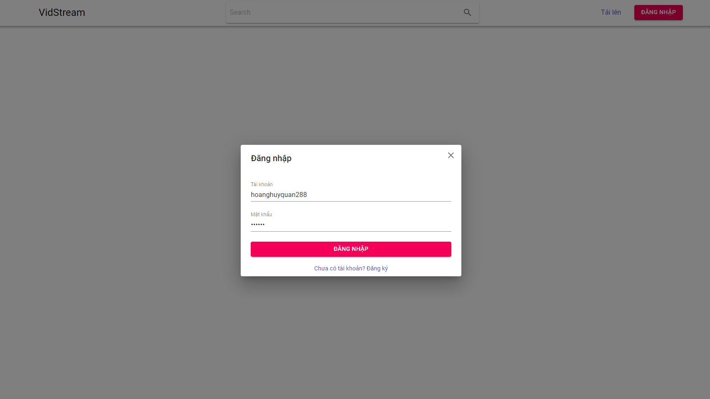
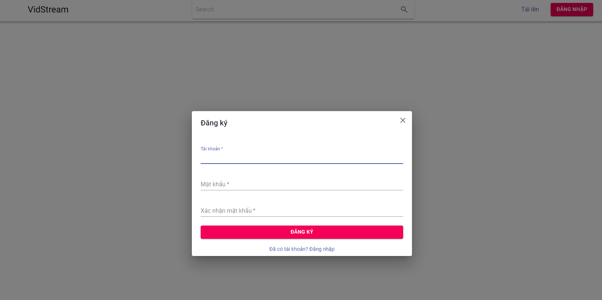
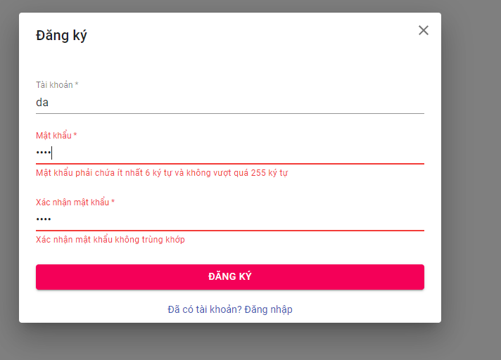
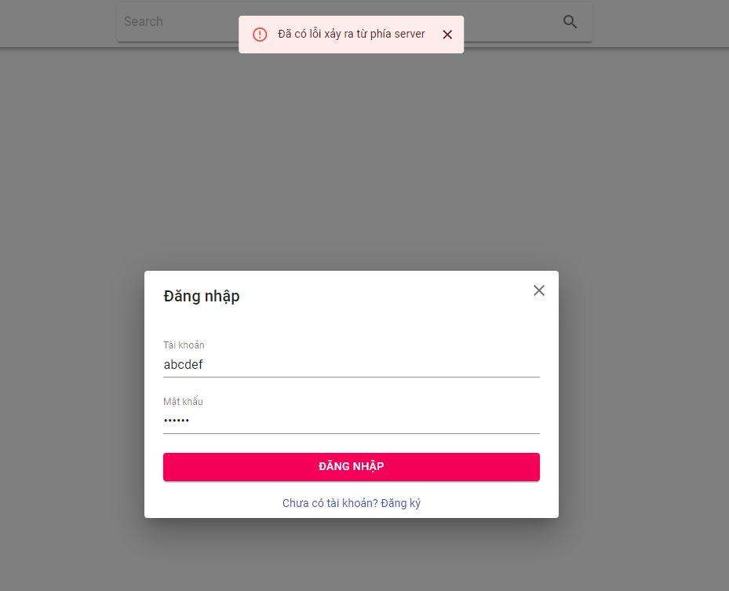

# Báo cáo tuần 10

## 1. Công việc đã thực hiện

- Frontend

  - Xây dựng giao diện và validate form đăng nhập/đăng ký
  - Viết api calling functions để gửi thông tin đăng nhập/đăng ký
  - Hiển thị thông báo lỗi khi nhận response từ server
  - Setup redux lưu thông tin authenticated user và hiển thị modal đăng nhập/đăng ký toàn cục
  - Setup routing (có viết private route cho các route cần người dùng đăng nhập)

- Backend

  - Video upload

    - Sửa lại AssetModel để lưu thông tin các file assets (chunk, manifest file, thumbnail)
    - Update lại VideoModel cập nhật thêm trạng thái cho video. Hiện tại đang có 3 trạng thái: **draft** (video được upload lên nhưng người dùng chưa thêm caption, giới hạn truy cập cho video), **published** (khi người dùng đã thêm đầy đủ caption và chọn đăng video), **deleted** (người dùng hủy không đăng video nữa)
    - Update lại phần upload file lên drive. Hiện tại các file thumbnail và file manifest sẽ được lưu local, chỉ upload các video chunks lên drive

  - Authentication
    - Viết các API đăng nhập/đăng ký (có trả về JWT token)
    - Viết authentication middleware để kiểm tra JWT token hợp lệ

## 2. Giao diện đã xây dựng

- Đăng nhập
    
 
        
    

- Đăng ký
    
 
        
    

- Validation
    

        
    

- Toast
    
 
        
    

## 3. Công việc cần bổ sung

- Authentication: Hiển thị thông báo thành công và điều hướng phù hợp khi người dùng tạo tài khoản thành công. Hiện tại sau khi đăng ký thành công thì đăng nhập cho người dùng luôn và chưa thực hiện gì thêm
- Video upload:
  - Hoàn thiện frontend xử lý upload thông tin video lên server (mô tả, giới hạn người xem)
  - Hoàn thiện API backend xử lý lưu thông tin video khi client gửi mô tả và thông tin giới hạn người xem lên server
- Tiếp tục các chức năng profile user, home view
