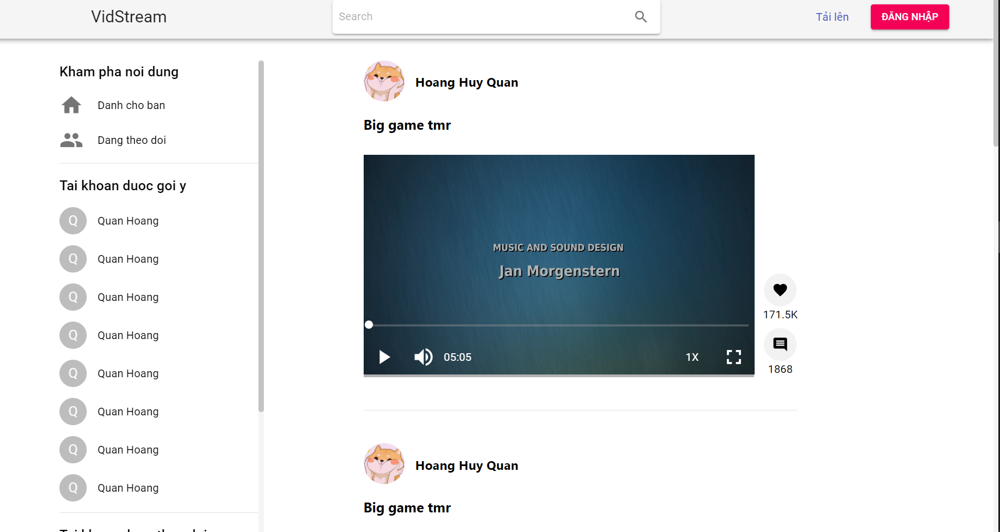
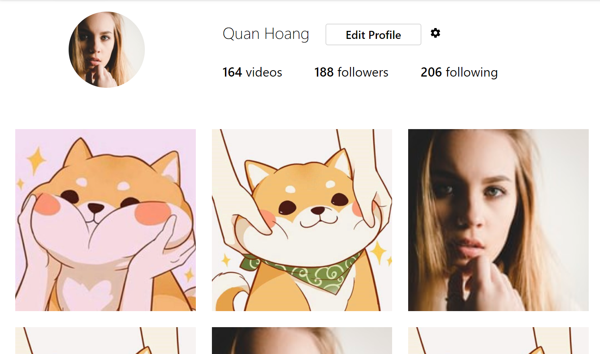

# Báo cáo tuần 10

## 1. Công việc đã thực hiện

- Frontend

  - Dựng UI các màn: Home, Profile
  - Update UI Upload: Xử lý validate và gửi metadata của video và hiển thị kết quả upload

- Backend

  - Video upload

    - Hoàn thiện phần upload: Xử lý metadata (author, caption, restriction) của video và lưu vào CSDL
    - Thêm mode public/private cho VideoModel

  - Profile
    - Viết API lấy danh sách các video đăng bởi 1 user

## 2. Giao diện đã xây dựng

- Home
    
 
        
    

- Profile
    
 
        
    

## 3. Công việc cần bổ sung

- Viết các api call ở phía frontend để get dữ liệu từ server cho các màn trên. Hiện tại đang dùng mock data để hiển thị
- Hoàn thiện thêm màn Home
- Get và persist redux state. Hiện tại userId đang để mặc định 1 giá trị cần update lấy trong redux và persist mỗi khi redirect hoặc reload trang
