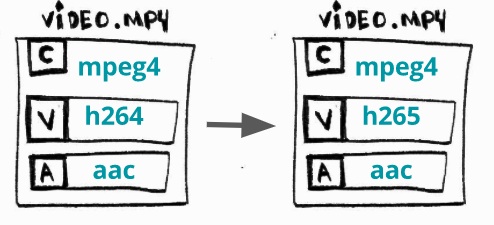

# Báo cáo tuần 6

## 1. Video processing
- Video encoding 
    - Video encoding là quá trình nén video gốc thành một định dạng mới phù hợp hơn và có kích thước nhỏ hơn, từ đó giúp quá trình truyền tải video trở nên dễ dàng hơn và chiếm dụng ít băng thông hơn
    - Việc chuyển đổi video sang một định dạng khác không chỉ giúp giảm kích thước video, mà còn giúp video tương thích với các thiết bị khác nhau do các nền tảng hỗ trợ phát video yêu cầu các định dạng video khác nhau 
- Video transcoding
    - Video transcoding là quá trình chuyển đổi video từ một định dạng sang định dạng khác được nén tốt hơn. Video transcoding khác với video encoding ở chỗ việc chuyển đổi được thực hiện trên video đã được nén sẵn.


## 2. Thông tin cần thiết để truyền tải video theo chunks
- Manifest file: Dùng để mô tả thông tin về các biểu diễn của video/audio và thông tin về các chunks của video
- DASH manifest file: 
    - Manifest file phục vụ cho streaming video theo giao thức DASH
    - Cấu trúc:
        <p align="center"> 
            
        </p>
        
        - Media Presentation: Chứa thông tin về các tất cả các loại media trong toàn bộ nội dung. Các loại media phổ biến nhất: video, audio,... MPD  chứa các thông tin bao gồm minimum buffer time, presentation duration và maximum segment duration, title.
        - Periods: DASH cho phép chia một video thành nhiều ```Periods```. Mặc định, quá trình playback diễn ra liên tục từ một Period sang Period kế tiếp, cung cấp cách thức tiện lợi để thêm các seek point cho từng chapter riêng biệt cần phân chia trong video.
        - Adaptation Sets: 
            - Một adaptation set chứa các biểu diễn khác nhau của media. Bên trong mỗi Adaptation Set, trình phát sẽ chỉ chọn một biểu diễn cho một video segment, tuy nhiên các segment khác nhau được phát có thể có biểu diễn khác nhau.
            - Video Adaptation Set thường chứa nhiều Representations tương ứng với các độ phân giải/bitrate khác nhau, cho phép trình phát video chọn biểu diễn tốt nhất có thể. Nếu video hỗ trợ nhiều hơn một codec thì mỗi codec sẽ ở trong một AdaptionSet riêng biệt.

        - Representations: 
            
            - Bên trong AdaptationSet, một Representaition mô tả một trong các phiên bản của nội dung media. Việc sử dụng nhiều Representations được áp dụng trong trường hợp cần mô tả nhiều bitrate khác nhau phục vụ cho Adaptive Bitrate Streaming. Mỗi biểu diễn đều bao gồm băng thông trung bình của Representation.

        - Segments: 
            
            - Segment chứa thông tin cần thiết để xây dựng URL thực sự dùng để download nội dung media. MPD có thể hoặc cung cấp một danh sách các segment URLS hoặc một template để trình phát nội dung có thể dùng để xây dựng URL một cách linh hoạt
            - Ví dụ về Segment List:
                ```
                <SegmentList duration="10">
                    <SegmentURL media="seg-m1-C2view-1.mp4"/>
                    <SegmentURL media="seg-m1-C2view-2.mp4"/>
                    <SegmentURL media="seg-m1-C2view-3.mp4"/>
                </SegmentList>
                ```  
            - Ví dụ về Segment Template:
                ```
                <SegmentTemplate
                    media="$Bandwidth%/$%04dNumber$.mp4v">
                </SegmentTemplate>
                ```
        - Base URL: Trong khi các URLs thực sự có thể dài hơn 100 kí tự, phần lớn các ký tự sẽ giống nhau cho tất cả các URLs. Vì vậy MPD cung cấp thuộc tính optional BaseURL dùng làm tiền tố cho tất cả các Segment URLs và chứa giao thức, tên miền.     

 

## 3. Tìm hiểu về FFmpeg
- FFmpeg là một thư viện xử lí đa phương tiện sử dụng giao diện dòng lệnh, hỗ trợ xử lý video và các loại đa phương tiện khác như audio
- Các thao tác thực hiện trong FFmpeg có dạng dưới đây ```ffmpeg {1} {2} -i {3} {4} {5}```, trong đó:
    1. global options
    2. input file options
    3. input url
    4. output file options 
    5. output url

    Ví dụ: 
    ```
    # WARNING: this file is around 300MB
    $ wget -O bunny_1080p_60fps.mp4 http://distribution.bbb3d.renderfarming.net/video/mp4/bbb_sunflower_1080p_60fps_normal.mp4

    $ ffmpeg \
    -y \ # global options
    -c:a libfdk_aac -c:v libx264 \ # input options
    -i bunny_1080p_60fps.mp4 \ # input url
    -c:v libvpx-vp9 -c:a libvorbis \ # output options
    bunny_1080p_60fps_vp9.webm # output url

    ```
    Câu lệnh này thực hiện chuyển đổi file input ```mp4``` chứa hai streams (một audio stream nén với ```aac``` CODEC và một video stream nén với ```h264``` CODEC) sang dạng ```webm```, thay đổi audio và video CODECS của file
- Một số thao tác xử lý video với FFmpeg: 
    
    - Transcoding: 
        <p align="center"> 
            
        </p>
        
        - Khái niệm: Là việc chuyển đổi một trong các streams (audio hoặc video) từ một CODEC sang một dạng khác
        - Mục đích: Một số thiết bị yêu cầu một số định dạng khác nhau và các CODECS mới mang lại tỉ lệ nén nội dung tốt hơn
        - Cú pháp: Ví dụ chuyển đổi video ở dạng ```H264``` sang ```H265```
            ```
            $ ffmpeg \
            -i bunny_1080p_60fps.mp4 \
            -c:v libx265 \
            bunny_1080p_60fps_h265.mp4
            ```
    
    - Transrating:
        <p align="center"> 
            
        </p>
        
        - Khái niệm: Thay đổi bitrate
        - Mục đích: Hỗ trợ phát nội dung trên nhiều điều kiện kết nối mạng khác nhau
        - Cú pháp: Tạo video mới với bitrate nằm trong khoảng 964K đến 3856k
            ```
            $ ffmpeg \
            -i bunny_1080p_60fps.mp4 \
            -minrate 964K -maxrate 3856K -bufsize 2000K \
            bunny_1080p_60fps_transrating_964_3856.mp4
            ```

    - Transsizing:
        <p align="center"> 
            
        </p>
        
        - Khái niệm: Chuyển đổi từ một độ phân giải sang độ phân giải khác. Thường được dùng đi kèm với thay đổi bitrate
        - Mục đích: Hỗ trợ phát nội dung trên nhiều điều kiện kết nối mạng/thiết bị khác nhau
        - Cú pháp: Chuyển đổi từ độ phân dải ```1080p``` sang ```480p```
            ```
            $ ffmpeg \
            -i bunny_1080p_60fps.mp4 \
            -vf scale=480:-1 \
            bunny_1080p_60fps_transsizing_480.mp4
            ```
    - Tạo nhiều phiên bản khác nhau phục vụ Adaptive Streaming:
         <p align="center"> 
            
        </p>
        
        - Khái niệm: Là quá trình tạo nhiều độ phân giải (bitrates) khác nhau và chia video thành các chunks và truyền tải thông qua HTTP.
        - Mục đích: Hỗ trợ phát nội dung trên nhiều điều kiện kết nối mạng/thiết bị khác nhau
        - Cú pháp: Tạo adaptive WebM sử dụng DASH
            ```
            # video streams
            $ ffmpeg -i bunny_1080p_60fps.mp4 -c:v libvpx-vp9 -s 160x90 -b:v 250k -keyint_min 150 -g 150 -an -f webm -dash 1 video_160x90_250k.webm

            $ ffmpeg -i bunny_1080p_60fps.mp4 -c:v libvpx-vp9 -s 320x180 -b:v 500k -keyint_min 150 -g 150 -an -f webm -dash 1 video_320x180_500k.webm

            $ ffmpeg -i bunny_1080p_60fps.mp4 -c:v libvpx-vp9 -s 640x360 -b:v 750k -keyint_min 150 -g 150 -an -f webm -dash 1 video_640x360_750k.webm

            $ ffmpeg -i bunny_1080p_60fps.mp4 -c:v libvpx-vp9 -s 640x360 -b:v 1000k -keyint_min 150 -g 150 -an -f webm -dash 1 video_640x360_1000k.webm

            $ ffmpeg -i bunny_1080p_60fps.mp4 -c:v libvpx-vp9 -s 1280x720 -b:v 1500k -keyint_min 150 -g 150 -an -f webm -dash 1 video_1280x720_1500k.webm

            # audio streams
            $ ffmpeg -i bunny_1080p_60fps.mp4 -c:a libvorbis -b:a 128k -vn -f webm -dash 1 audio_128k.webm

            # the DASH manifest
            $ ffmpeg \
            -f webm_dash_manifest -i video_160x90_250k.webm \
            -f webm_dash_manifest -i video_320x180_500k.webm \
            -f webm_dash_manifest -i video_640x360_750k.webm \
            -f webm_dash_manifest -i video_640x360_1000k.webm \
            -f webm_dash_manifest -i video_1280x720_500k.webm \
            -f webm_dash_manifest -i audio_128k.webm \
            -c copy -map 0 -map 1 -map 2 -map 3 -map 4 -map 5 \
            -f webm_dash_manifest \
            -adaptation_sets "id=0,streams=0,1,2,3,4 id=1,streams=5" \
            manifest.mpd
            ```


## 4. Khó khăn
- Chưa tìm được cách tiếp cận phù hợp để upload video. Các công đoạn cần xử lý:
    
    - Upload từ client lên server 
    - Xử lý video phía server 
    - Upload từ server lên cloud

- Cần tìm hiểu thêm cách đọc nội dung file manifest để fetch các chunks từ server
- Chưa biết cách tách video thành hai stream audio và video riêng biệt (do DASH yêu cầu hai streams phải được lưu riêng biệt trước khi xử lý) 
