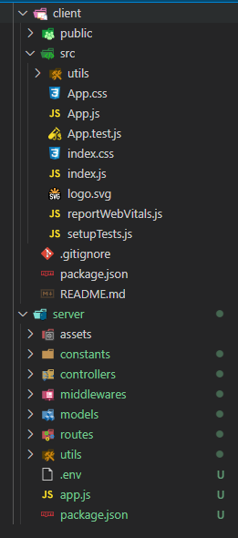
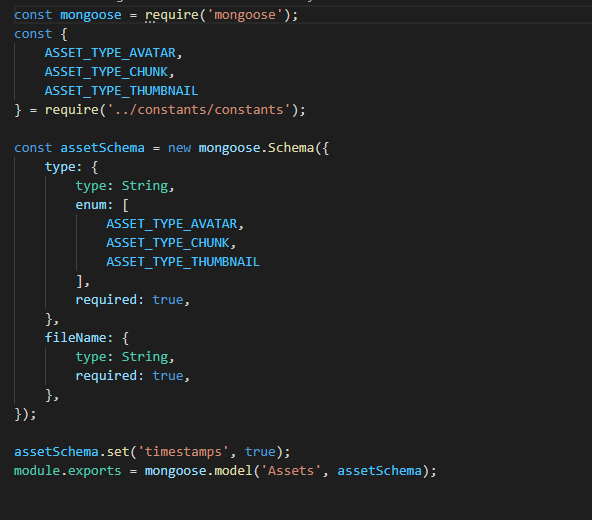
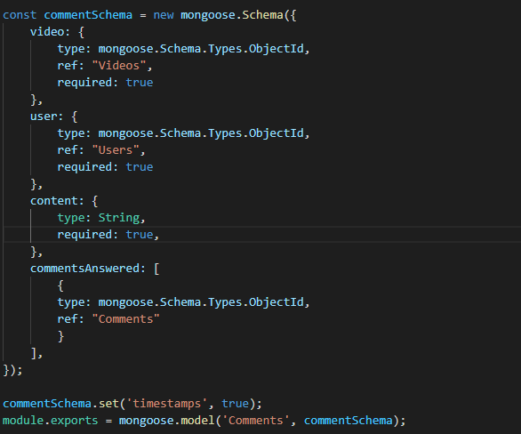
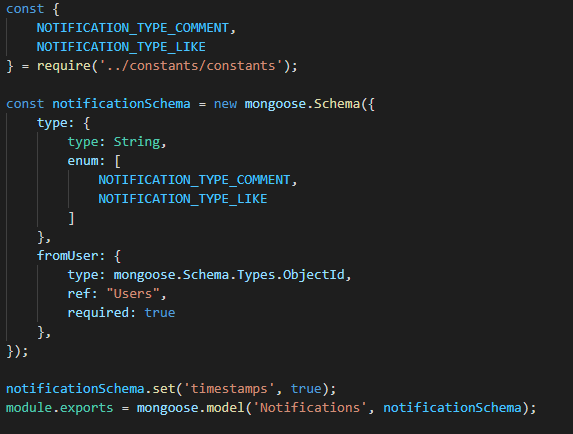
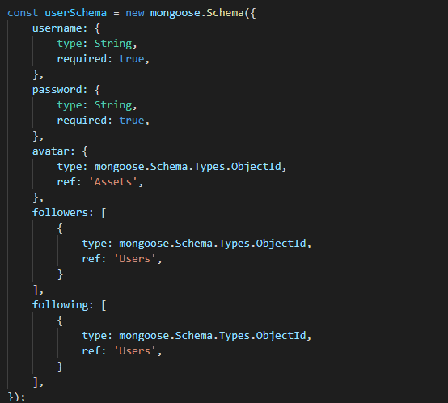
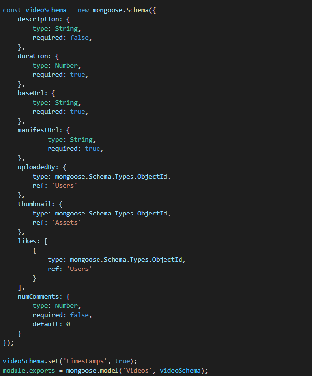

# Báo cáo tuần 6

## 1. Thiết kế database
- Sơ đồ thiết kế cơ sở dữ liệu
    
 
        
    

- Đặc tả các bảng
    - <b>Assets</b>: Chứa các thông tin về các files được upload bởi user (avatar) hoặc các metadata của video (thumbnail, manifest files)
    - <b>Comments</b>: Lưu thông tin về nội dung bình luận của 1 user
    - <b>Notifications</b>: Lưu các thông báo của tương ứng với 1 video
    - <b>Users</b>: Chứa các thông tin cá nhân của user, các người dùng đang theo dõi (following) và đang được theo dõi (followers). Ngoài ra bảng Users còn chứa trường avatar là id của đối tượng biểu diễn cho ảnh đại diện của người dùng được lưu trữ phía server
    - <b>Videos</b>: Lưu các metadata của video, ngoài ra bảng Videos còn chứa thông tin về lượt likes và số lượng comments của video

## 2. Khởi tạo project React + Node + MongoDB
- Cấu trúc project
    
 
        
    

- Khởi tạo MongoDB:
    
    - <b>Assets</b>:
        
 
            
        

    - <b>Comments</b>:
        
 
            
        

    - <b>Notifications</b>:
        
 
            
        

    - <b>Users</b>:
        
 
            
        

    - <b>Videos</b>:
        
 
            
        
