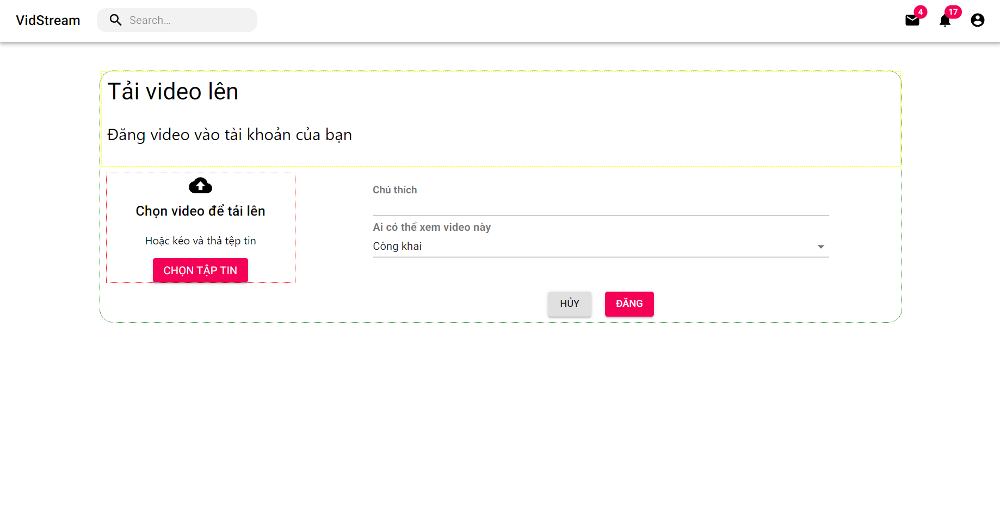

# Báo cáo tuần 6

## 1. Video uploading - Frontend
- Giao diện chính
    
 
        
    

- Các phần cần bổ sung
    - Xử lý response trả về từ phía server
    - Popup thông báo khi có lỗi hoặc đăng video thành công
    - Xử lí sự kiện đăng bài. Hiện tại mới chỉ test upload video khi nhấn chọn tập tin
    - CSS thêm phần giao diện

## 2. Video uploading - Backend
- Các công việc đã thực hiện:
    
    - Validate file input từ phía client gửi lên (kiểm tra extension, file size)
    - Tạo thumbnail cho video (Hiện tại đang lấy giây đầu tiên làm thumbnail)
    - Encode video (tạo thành 3 độ phân giải khác nhau và tách ra thành nhiều chunks nhỏ, kèm theo file manifest sau khi encode xong). Sau quá trình encode video các file được sinh ra được lưu tạm thời vào folder tmp ở phía server
    - Upload các files được tạo ra ở bước trước lên cloud. Hiện tại đang sử dụng google drive để lưu trữ files. Sau khi upload files lên cloud thành công tiến hành xóa các files lưu tạm thời ở phía server

- Công việc cần bổ sung:

    - Xử lí lưu các thông tin liên quan đến video vào CSDL. Hiện tại mới thực hiện xử lý và upload video lên cloud storage
    - Xử lí logic upload video. Hiện tại việc upload video sẽ có 2 bước: Upload video lên trước sau đó client tiếp tục điền các thông tin liên quan đến video (chú thích, giới hạn người xem), tuy nhiên phía server đang thực hiện upload video lên drive luôn -> có thể phải update lại  khi người dùng hủy không đăng video nữa